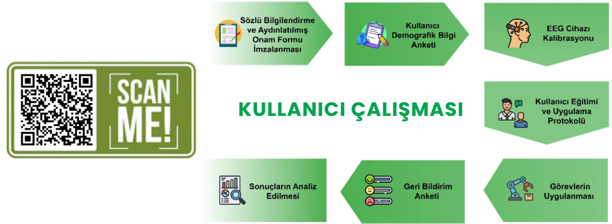

# Zihinsel Odaklanma İle Robotik Kol Kontrolü

Bu proje, uzuv kaybı veya nörolojik rahatsızlıklar nedeniyle hareket kabiliyeti kısıtlanan bireyler için düşük maliyetli ve taşınabilir bir Beyin-Bilgisayar Arayüzü (BBA) sistemi geliştirmeyi amaçlamaktadır. Emotiv Epoc X EEG başlığından elde edilen beyin sinyalleri kullanılarak kullanıcının odak seviyesi analiz edilmiş ve bu bilgi Raspberry Pi tabanlı bir sistem üzerinden 4 eksenli robot kol kontrolüne dönüştürülmüştür.

## Proje Hakkında ve Sistem Mimarisi

Geliştirilen sistem, gerçek zamanlı insan-makine etkileşimini destekleyen erişilebilir bir çözüm sunmaktadır. Karmaşık sınıflandırma modelleri yerine stabil odak tetikleyicileri kullanılarak algoritmik karmaşa ile operasyonel kararlılık arasındaki denge başarıyla kurulmuştur.

Projenin ağır hesaplama ve sinyal işleme adımları uç cihazda değil, ana bilgisayar (host) üzerinde gerçekleştirilmektedir. Sistem akışı şu şekildedir:
1. **Veri Toplama:** Emotiv Cortex API aracılığıyla EEG verileri ve Emotiv metrikleri toplanır. Bu çalışmada kontrol parametresi olarak Emotiv App'in sağladığı *Focus* (Odaklanma) metriği tercih edilmiştir.
2. **Eşik Kararı (Thresholding):** Odaklanma verisi ana bilgisayar üzerinde işlenir. Odak seviyesi **%60'ın üzerine çıktığında** "Aktif", altına düştüğünde ise "Pasif" komutu üretilir.
3. **Haberleşme:** Üretilen komutlar UDP protokolü üzerinden ağdaki Raspberry Pi 5'e aktarılır. 
4. **Fiziksel Kontrol:** Raspberry Pi 5 üzerinde çalışan RPI.GPIO kütüphanesi kullanılarak robotun servolarının kontrolü sağlanır. Aktif durumunda robot kol hareket ederken, pasif durumunda güvenli bir şekilde durur.

## Kullanıcı Çalışması ve Metodoloji

Sistemin gerçek zamanlı performansını ve kullanıcı deneyimini değerlendirmek amacıyla laboratuvar ortamında 16 gönüllü katılımcı ile bir kullanıcı çalışması yürütülmüştür. 

Katılımcılara kalibrasyon ve kısa bir eğitim verildikten sonra, 30 saniyelik süre sınırı ve 2 deneme hakkı dahilinde odak seviyelerini yöneterek robot kolla kutu alma-bırakma ve sistemi durdurma görevlerini gerçekleştirmeleri istenmiştir.

Aşağıdaki şema, bu kullanıcı çalışmasının aşamalarını göstermektedir:

## Deneysel Bulgular ve Sonuçlar

Odak metriğinin kullanılmasıyla istemsiz algılamalar azalmış ve sistemin dış etkenlere karşı dayanıklılığı artmıştır. Yapılan testlerin sonuçları projenin başarısını kanıtlamaktadır:

* **Görev Başarısı:** 16 katılımcıdan 13'ü robot kol kontrol görevlerini başarıyla tamamlamıştır. (9 katılımcı ilk denemesinde, 4 katılımcı ikinci denemesinde başarılı olmuştur).
* **Kullanılabilirlik (UEQ-S Anketleri):** Sistem kullanıcılar tarafından sade (6,19/7) ve açık (6,50/7) bulunmuştur.
* **İş Yükü ve Stres:** Süreç boyunca oldukça düşük stres (1,94/7), zihinsel yorgunluk (2,06/7) ve fiziksel iş yükü (3,13/7) raporlanmıştır.
* **Kullanıcı Memnuniyeti:** Genel memnuniyet 6,38/7 olarak ölçülürken, sistemi tekrar deneyimleme isteği tam puana (7,00/7) ulaşmıştır.

Bu çalışma, yüksek maliyetli laboratuvar BBA teknolojilerinin tüketici sınıfı donanımlarla erişilebilir pratik projelere dönüştürülebileceğini göstermiştir. Dağıtık ağ mimarisiyle sağlanan düşük gecikmeli iletimin, acil durdurma gerektiren iş güvenliği senaryolarında uygulanma potansiyeli taşıdığı değerlendirilmektedir.
