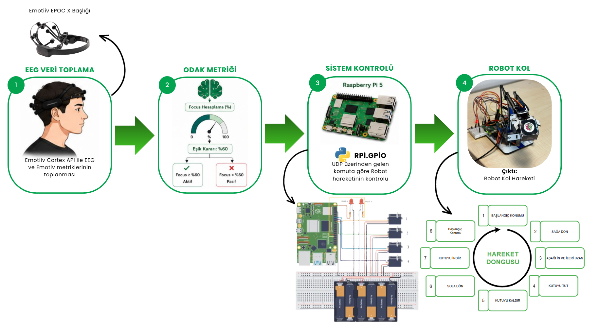

# Zihinsel Odaklanma İle Robotik Kol Kontrolü

Bu proje, uzuv kaybı veya nörolojik rahatsızlıklar nedeniyle hareket kabiliyeti kısıtlanan bireyler için düşük maliyetli ve taşınabilir bir Beyin-Bilgisayar Arayüzü (BBA) sistemi geliştirmeyi amaçlamaktadır[cite: 1]. Emotiv Epoc X EEG başlığından elde edilen beyin sinyalleri kullanılarak kullanıcının odak seviyesi analiz edilmiş ve bu bilgi Raspberry Pi tabanlı bir sistem üzerinden 4 eksenli robot kol kontrolüne dönüştürülmüştür[cite: 1].

## Proje Hakkında ve Sistem Mimarisi

Geliştirilen sistem, gerçek zamanlı insan-makine etkileşimini destekleyen erişilebilir bir çözüm sunmaktadır[cite: 1]. Karmaşık sınıflandırma modelleri yerine stabil odak tetikleyicileri kullanılarak algoritmik karmaşa ile operasyonel kararlılık arasındaki denge başarıyla kurulmuştur[cite: 1].

Projenin ağır hesaplama ve sinyal işleme adımları uç cihazda değil, ana bilgisayar (host) üzerinde gerçekleştirilmektedir. Sistem akışı şu şekildedir:
1. **Veri Toplama:** Emotiv Cortex API aracılığıyla EEG verileri ve Emotiv metrikleri toplanır[cite: 1]. Bu çalışmada kontrol parametresi olarak Emotiv App'in sağladığı *Focus* (Odaklanma) metriği tercih edilmiştir[cite: 1].
2. **Eşik Kararı (Thresholding):** Odaklanma verisi ana bilgisayar üzerinde işlenir[cite: 1]. Odak seviyesi **%60'ın üzerine çıktığında** "Aktif", altına düştüğünde ise "Pasif" komutu üretilir[cite: 1].
3. **Haberleşme:** Üretilen komutlar UDP protokolü üzerinden ağdaki Raspberry Pi 5'e aktarılır[cite: 1]. 
4. **Fiziksel Kontrol:** Raspberry Pi 5 üzerinde çalışan RPI.GPIO kütüphanesi kullanılarak robotun servolarının kontrolü sağlanır[cite: 1]. Aktif durumunda robot kol hareket ederken, pasif durumunda güvenli bir şekilde durur[cite: 1].



## Kullanıcı Çalışması ve Metodoloji

Sistemin gerçek zamanlı performansını ve kullanıcı deneyimini değerlendirmek amacıyla laboratuvar ortamında 16 gönüllü katılımcı ile bir kullanıcı çalışması yürütülmüştür[cite: 1]. 

Katılımcılara kalibrasyon ve kısa bir eğitim verildikten sonra, 30 saniyelik süre sınırı ve 2 deneme hakkı dahilinde odak seviyelerini yöneterek robot kolla kutu alma-bırakma ve sistemi durdurma görevlerini gerçekleştirmeleri istenmiştir[cite: 1].

Aşağıdaki şema, bu kullanıcı çalışmasının aşamalarını göstermektedir:


## Deneysel Bulgular ve Sonuçlar

Odak metriğinin kullanılmasıyla istemsiz algılamalar azalmış ve sistemin dış etkenlere karşı dayanıklılığı artmıştır[cite: 1]. Yapılan testlerin sonuçları projenin başarısını kanıtlamaktadır:

* **Görev Başarısı:** 16 katılımcıdan 13'ü robot kol kontrol görevlerini başarıyla tamamlamıştır[cite: 1]. (9 katılımcı ilk denemesinde, 4 katılımcı ikinci denemesinde başarılı olmuştur)[cite: 1].
* **Kullanılabilirlik (UEQ-S Anketleri):** Sistem kullanıcılar tarafından sade (6,19/7) ve açık (6,50/7) bulunmuştur[cite: 1].
* **İş Yükü ve Stres:** Süreç boyunca oldukça düşük stres (1,94/7), zihinsel yorgunluk (2,06/7) ve fiziksel iş yükü (3,13/7) raporlanmıştır[cite: 1].
* **Kullanıcı Memnuniyeti:** Genel memnuniyet 6,38/7 olarak ölçülürken, sistemi tekrar deneyimleme isteği tam puana (7,00/7) ulaşmıştır[cite: 1].

Bu çalışma, yüksek maliyetli laboratuvar BBA teknolojilerinin tüketici sınıfı donanımlarla erişilebilir pratik projelere dönüştürülebileceğini göstermiştir[cite: 1]. Dağıtık ağ mimarisiyle sağlanan düşük gecikmeli iletimin, acil durdurma gerektiren iş güvenliği senaryolarında uygulanma potansiyeli taşıdığı değerlendirilmektedir[cite: 1].

## Kurulum ve Çalıştırma

1. Projeyi klonlayın:
   ```bash
   git clone [https://github.com/kullaniciadin/eeg-robotic-arm.git](https://github.com/kullaniciadin/eeg-robotic-arm.git)
